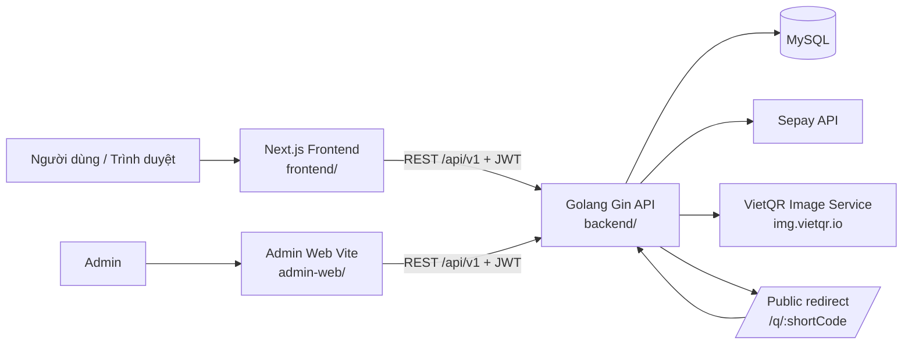
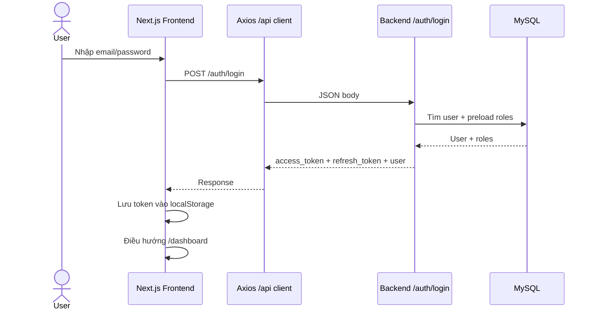
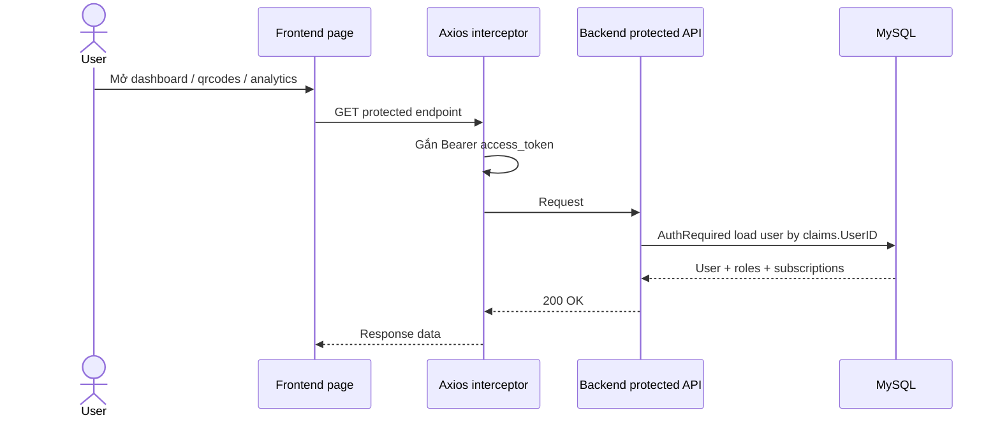
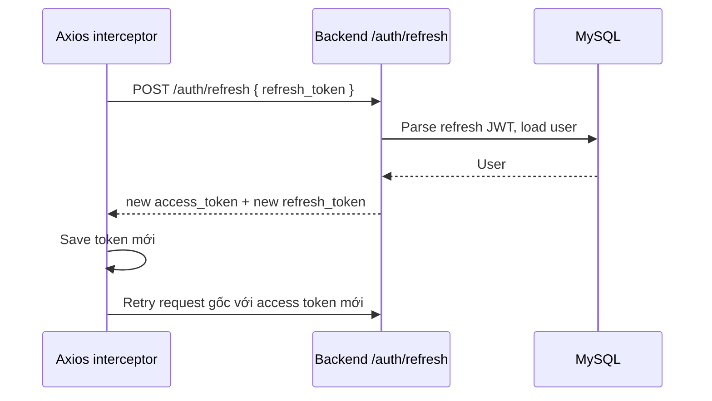
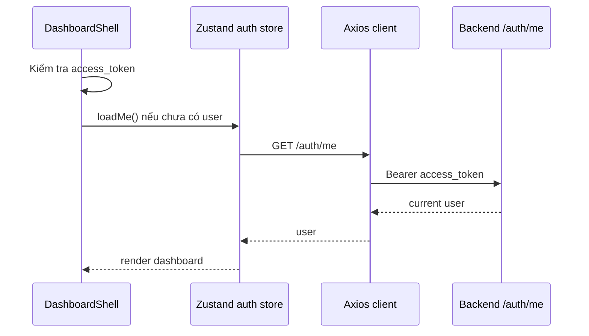
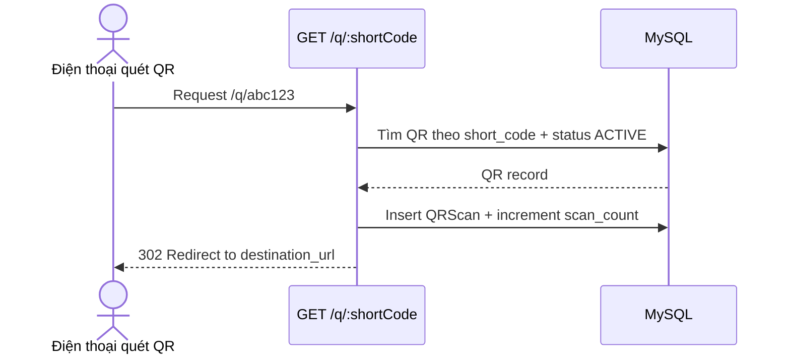
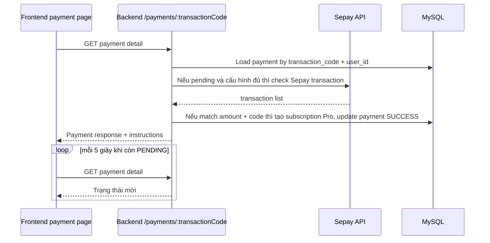
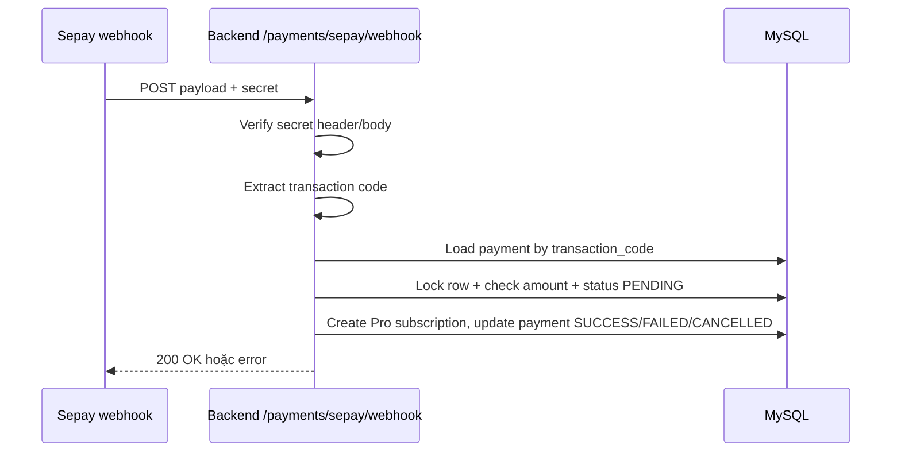
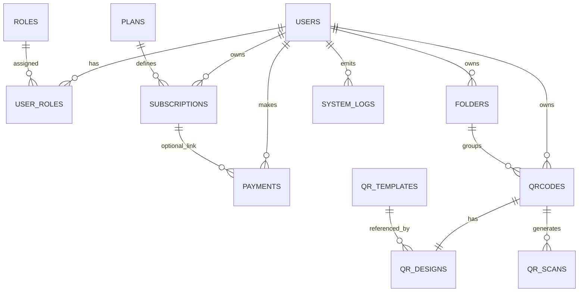

# QR Generator - Project Overview

Tài liệu này mô tả dự án QR Generator - QR Studio dựa trên source code và tài liệu hiện có trong repository. Mục tiêu là giúp developer mới hiểu nhanh kiến trúc, công nghệ, quy tắc nghiệp vụ, các luồng chính và những phần đã triển khai hoặc còn dang dở mà không cần đọc toàn bộ source code ngay từ đầu.

## 1. Phạm vi thực tế và trạng thái triển khai

| Hạng mục | Trạng thái | Bằng chứng | Ghi chú |
|---|---|---|---|
| Đăng ký, đăng nhập, refresh token, `/auth/me`, đổi mật khẩu | Đã triển khai | `backend/internal/modules/auth/*`, `backend/internal/middleware/auth.go`, `frontend/components/forms/AuthForms.tsx` | JWT access/refresh token lưu ở `localStorage`. |
| Static QR URL/TEXT/WIFI/VCARD/EMAIL/SMS/LOCATION | Đã triển khai | `backend/internal/modules/qrcodes/handler.go`, `frontend/components/qrcode/QRTypeFields.tsx` | Frontend format chuỗi trước khi gửi, backend kiểm tra một phần. |
| Dynamic QR cho URL | Đã triển khai | `backend/internal/modules/qrcodes/handler.go`, `backend/internal/modules/qrcodes/handler_test.go` | Chỉ hỗ trợ `QRType=URL`. |
| Folders | Đã triển khai | `backend/internal/modules/folders/handler.go`, `frontend/app/folders/page.tsx` | CRUD cơ bản. |
| Plans FREE/PRO | Đã triển khai | `backend/internal/database/seed.go`, `backend/internal/modules/plans/handler.go`, `frontend/app/pricing/page.tsx` | Seed từ startup. |
| Subscription hiện tại | Đã triển khai | `backend/internal/modules/users/handler.go`, `frontend/app/dashboard/page.tsx`, `frontend/app/pricing/page.tsx` | Đọc từ endpoint `/users/subscription`. |
| Payment Pro qua Sepay | Đã triển khai một phần | `backend/internal/modules/payments/handler.go`, `frontend/app/payments/[transactionCode]/page.tsx` | Tạo payment, QR VietQR, webhook, polling đều có; chưa thấy test riêng cho payment. |
| Scan analytics | Đã triển khai một phần | `backend/internal/modules/analytics/handler.go`, `frontend/app/analytics/page.tsx` | Summary theo ngày/thiết bị/browser có; location hiện chưa có dữ liệu thực. |
| QR design | Đã triển khai một phần | `backend/internal/models/models.go`, `backend/internal/modules/qrcodes/handler.go`, `frontend/components/qrcode/CreateQRForm.tsx` | Lưu màu sắc/kích thước/template/logo URL; renderer hiện chỉ dùng màu và size ở frontend preview, backend download vẫn đơn giản. |
| Social/PDF/Menu | Có UI và backend nhưng là URL wrapper | `frontend/components/qrcode/QRTypeFields.tsx`, `backend/internal/modules/qrcodes/handler.go` | Thực tế đang validate như URL, chưa có profile/menu/document engine chuyên biệt. |
| SVG/PDF export QR | Có trong plan/model nhưng chưa thấy code sinh export | `backend/internal/models/models.go`, `backend/internal/database/seed.go` | Hiện chỉ thấy download PNG. |
| Admin module | Đã triển khai | `backend/internal/modules/admin/handler.go`, `admin-web/src/App.tsx` | Có backend admin và một app Vite riêng. |
| Migrations versioned | Chưa triển khai | `backend/migrations` trống, `backend/internal/database/database.go` dùng `AutoMigrate` | Đây là MVP theo startup seed. |
| Geolocation analytics | Chưa triển khai đầy đủ | `backend/internal/models/models.go`, `backend/internal/modules/qrcodes/handler.go`, `backend/internal/modules/analytics/handler.go` | Có cột `country/city` nhưng redirect chưa ghi dữ liệu geo. |

## 2. QR Generator là hệ thống gì

QR Generator - QR Studio là một hệ thống web tạo và quản lý mã QR theo mô hình client-server. Hệ thống giải quyết ba vấn đề chính:

- tạo QR nhanh cho nhiều loại dữ liệu phổ biến như URL, Text, WiFi, vCard, Email, SMS, Location;
- quản lý QR theo tài khoản, thư mục, gói dịch vụ và trạng thái;
- với QR động, ghi nhận lượt quét, đổi URL đích về sau và theo dõi analytics.

Người dùng chính:

- khách truy cập muốn tìm hiểu hoặc tạo thử QR;
- user Free muốn tạo QR cơ bản với giới hạn;
- user Pro muốn dùng QR động, analytics, logo và template nâng cao;
- admin muốn quản trị hệ thống qua backend admin API và app riêng `admin-web/`.

### Sơ đồ thành phần tổng thể



## 3. Công nghệ sử dụng

| Thành phần | Công nghệ / thư viện | File hoặc module sử dụng | Vai trò | Bằng chứng / lý do |
|---|---|---|---|---|
| Backend web API | Go 1.22 | `backend/cmd/server/main.go`, `backend/internal/router/router.go` | Xử lý HTTP, business rule, redirect public | `go.mod` khai báo Go 1.22, Gin là HTTP framework chính. |
| HTTP framework | Gin | `backend/internal/router/router.go` và toàn bộ `backend/internal/modules/*` | Route, middleware, bind JSON, response | `github.com/gin-gonic/gin` trong `go.mod`. |
| ORM | GORM | `backend/internal/database/database.go`, `backend/internal/models/models.go` | AutoMigrate, query, transaction, relation | `gorm.io/gorm`, MySQL driver trong `go.mod`. |
| Database | MySQL | `backend/internal/config/config.go`, `backend/internal/database/database.go`, `docker-compose.yml` | Lưu user, plan, QR, scan, payment, log | `DATABASE_URL`, `DB_*`, docker compose service `mysql`. |
| Auth | JWT HS256 | `backend/internal/utils/jwt.go`, `backend/internal/modules/auth/handler.go` | Access token, refresh token | Access/refresh secret riêng, refresh stateless. |
| Password hashing | bcrypt | `backend/internal/utils/password.go` | Hash/check password | `golang.org/x/crypto/bcrypt`. |
| QR PNG generation | `skip2/go-qrcode` | `backend/internal/utils/qrcode.go` | Sinh PNG cho download QR | Backend download trả `image/png`. |
| Dynamic QR preview | `qrcode.react` | `frontend/components/qrcode/QRPreview.tsx` | Vẽ QR ở client | Preview không phụ thuộc backend render image. |
| Frontend app | Next.js 16 + React 19 | `frontend/app/*`, `frontend/components/*` | Public/user dashboard pages | App Router, `use client` ở các page động. |
| Admin web | Vite + React 19 | `admin-web/src/App.tsx` | Admin dashboard riêng | `admin-web/package.json`, route độc lập, token riêng. |
| State management | Zustand | `frontend/stores/auth.ts` | Lưu user hiện tại, logout, loadMe | Auth store đơn giản, client-side. |
| API client | Axios | `frontend/lib/api.ts` | Gắn Bearer token, refresh token, parse lỗi | Interceptor refresh tự động. |
| Validation | Zod + react-hook-form | `frontend/lib/validators.ts`, `frontend/components/forms/AuthForms.tsx` | Validate login/register | Form auth dùng schema xác thực client. |
| UI styling | Tailwind CSS | `frontend/app/globals.css`, `frontend/tailwind.config.ts`, `frontend/components/*` | Layout và component style | Tailwind v3.4, utility-first. |
| Charts | Recharts | `frontend/components/analytics/ScanCharts.tsx` | Biểu đồ analytics | Bar chart theo ngày/device/browser. |
| Containers | Docker | `backend/Dockerfile`, `frontend/Dockerfile`, `docker-compose.yml` | Build, chạy local/dev/deploy | Multi-stage build cho cả backend và frontend. |
| Deploy target | Render + Aiven MySQL | `frontend/.env`, `backend/.env`, `backend/internal/config/config.go` | Môi trường production thực tế | Frontend env trỏ Render; backend env có Aiven `DATABASE_URL` và `DB_SSL_CA`. |
| Payment | Sepay + VietQR | `backend/internal/modules/payments/handler.go`, `frontend/app/payments/[transactionCode]/page.tsx` | Thanh toán Pro, QR chuyển khoản | Backend sinh VietQR content/image URL. |

## 4. Nguyên tắc tạo QR Code

### 4.1 QR Code là gì

Ở mức nghiệp vụ, QR Code là một cách đóng gói dữ liệu ngắn vào ma trận ô vuông để điện thoại hoặc app quét đọc được. Ở mức kỹ thuật, nội dung QR là một chuỗi ký tự đã được encode thành các module đen/trắng theo chuẩn QR, có thể chứa URL, text thuần, chuỗi theo scheme chuẩn như `WIFI:`, `mailto:`, `smsto:` hoặc `geo:`.

### 4.2 Hệ thống đang dùng thư viện nào

- Backend download PNG dùng `github.com/skip2/go-qrcode` trong `backend/internal/utils/qrcode.go`.
- Frontend preview dùng `qrcode.react` trong `frontend/components/qrcode/QRPreview.tsx`.
- Payment QR không dùng thư viện QR nội bộ, mà dùng VietQR image URL từ `img.vietqr.io`.

### 4.3 Dữ liệu nào được encode vào QR

Có 4 lớp dữ liệu cần phân biệt:

- dữ liệu người dùng nhập trong UI;
- chuỗi `content` được backend lưu vào DB;
- URL trung gian dùng cho Dynamic QR, ví dụ `http://backend/q/<shortCode>`;
- URL đích cuối cùng chỉ dùng để redirect khi quét Dynamic QR.

Cụ thể:

- Static QR: `content` chính là chuỗi encode vào QR.
- Dynamic QR: QR encode `DynamicURL(AppURL, shortCode)`; `destination_url` chỉ nằm trong DB.
- `short_code` nằm trong DB để map sang `destination_url`.

### 4.4 QR được tạo ở backend hay frontend

Cả hai:

- Frontend sinh QR preview ngay trên trình duyệt bằng `qrcode.react`.
- Backend sinh file PNG khi gọi `/qrcodes/:id/download` bằng `go-qrcode`.

Điểm quan trọng: backend hiện không lưu ảnh QR vào DB, dù model có field `qr_image_url`.

### 4.5 Design QR gồm gì

Model `QRDesign` có các field:

- `foreground_color`
- `background_color`
- `eye_style`
- `dot_style`
- `frame_style`
- `logo_url`
- `size`
- `error_correction_level`

Nhưng theo code hiện tại:

- frontend preview chỉ dùng màu nền, màu foreground và size;
- backend download PNG cũng chỉ dùng `content` và `size`, còn `go-qrcode` đang hard-code mức `Medium`;
- `logo_url`, `eye_style`, `dot_style`, `frame_style`, `error_correction_level` được lưu, nhưng chưa thấy renderer nội bộ áp dụng đầy đủ.

### 4.6 Error correction level

Các mức có trong model là:

- `L`: ~7% recovery
- `M`: ~15% recovery
- `Q`: ~25% recovery
- `H`: ~30% recovery

Trong code hiện tại:

- design model và UI có field `error_correction_level`;
- `frontend/components/qrcode/CreateQRForm.tsx` gửi `M` mặc định;
- `backend/internal/utils/qrcode.go` đang encode PNG với `qrcode.Medium`, nên thực tế backend download chưa dùng giá trị L/M/Q/H từ thiết kế.

### 4.7 Static QR vs Dynamic QR

- Static QR: dữ liệu được encode trực tiếp vào QR; nếu nội dung thay đổi thì phải tạo mã mới.
- Dynamic QR: QR chỉ encode một URL trung gian chứa `shortCode`; backend redirect đến `destination_url` lưu trong DB.

Hệ thống hiện chỉ cho Dynamic QR với `QRType=URL`. Các type khác không được phép đặt `is_dynamic=true`.

### 4.8 Static QR có thể disable không

Có. `QRCode.status` có thể là `ACTIVE`, `DISABLED`, hoặc `DELETED`.

- Với Static QR, trạng thái `DISABLED` chỉ ảnh hưởng tới record quản lý trong hệ thống; QR đã in vẫn encode dữ liệu cũ vì nội dung nằm trực tiếp trong hình.
- Với Dynamic QR, nếu `DISABLED` thì route `/q/:shortCode` trả 404 và không redirect.

### 4.9 Dynamic QR bị disable xử lý thế nào

Trong `backend/internal/modules/qrcodes/handler.go`, redirect kiểm tra:

- `short_code` có tồn tại;
- `is_dynamic = true`;
- `qr_type = URL`;
- `status = ACTIVE`;
- `destination_url` không rỗng.

Nếu không thỏa, route trả 404 và không ghi scan.

### 4.10 Giới hạn hiện có

- Hiện chưa thấy hỗ trợ sinh SVG/PDF thực sự, dù plan có `allow_svg_pdf_export`.
- Không thấy renderer logo/eye/dot/frame đầy đủ.
- Không có lưu ảnh QR vào DB.

## 5. Phân tích từng loại QR

| Loại QR | UI yêu cầu dữ liệu gì | Chuỗi format | Encode vào QR như thế nào | Có phải URL không | Hỗ trợ Dynamic | Trạng thái thực tế |
|---|---|---|---|---|---|---|
| URL | `Website URL` | URL thuần, ví dụ `https://example.com` | `content` là URL | Có | Có, nhưng chỉ khi `is_dynamic=true` | Đã triển khai. |
| TEXT | Nội dung text bất kỳ | Chuỗi text thuần | Encode nguyên văn | Không | Không | Đã triển khai. |
| WIFI | SSID, password, encryption, hidden | `WIFI:T:<enc>;S:<ssid>;P:<pass>;H:<true|false>;;` | Encode chuỗi theo chuẩn Wi-Fi QR | Không | Không | Đã triển khai. |
| VCARD | Họ, tên, phone, email, company, title | `BEGIN:VCARD...END:VCARD` | Encode chuỗi vCard nhiều dòng | Không | Không | Đã triển khai. |
| EMAIL | To, subject, body | `mailto:<to>?subject=...&body=...` | Mở mail app | Có dạng URI | Không | Đã triển khai. |
| SMS | Số điện thoại, nội dung | `smsto:<phone>:<message>` | Mở ứng dụng SMS | Có dạng URI | Không | Đã triển khai. |
| LOCATION | Latitude, longitude | `geo:<lat>,<lng>` | Mở bản đồ trên điện thoại | Có dạng URI | Không | Đã triển khai. |
| SOCIAL | URL profile social | Hiện đang là URL thuần | Backend validate như URL | Có | Không | Có UI và backend, nhưng chỉ là URL wrapper. |
| PDF | URL tài liệu PDF | Hiện đang là URL thuần | Backend validate như URL | Có | Không | Có UI và backend, nhưng chỉ là URL wrapper. |
| MENU | URL menu online | Hiện đang là URL thuần | Backend validate như URL | Có | Không | Có UI và backend, nhưng chỉ là URL wrapper. |

### Ghi chú format chuẩn

- `WIFI:T:...` đang được tạo ở `frontend/components/qrcode/QRTypeFields.tsx`.
- `BEGIN:VCARD` / `END:VCARD` được dựng chuỗi vCard 3.0.
- `mailto:` dùng cho email.
- `smsto:` dùng cho SMS.
- `geo:` dùng cho location.

### Ghi chú về SOCIAL, PDF, MENU

Trong code hiện tại, ba type này không có engine riêng cho social profile, document viewer hay menu chuyên biệt. Chúng được xử lý giống URL tĩnh, và chỉ được phân biệt bằng `qr_type` để áp dụng rule Pro.

## 6. Luồng đăng ký, đăng nhập và xác thực

### 6.1 Tổng quan

- Register tạo user mới, hash password bằng bcrypt, gán role `USER`, và tạo subscription `FREE`.
- Login kiểm tra email/password, sau đó trả `access_token` và `refresh_token`.
- Refresh dùng refresh JWT để cấp token mới.
- Logout hiện chỉ xóa token ở client; không có token blacklist hoặc session store phía server.
- `/auth/me` đọc user từ context do middleware gắn vào.

### 6.2 Middleware xác thực

`backend/internal/middleware/auth.go`:

- đọc `Authorization: Bearer <token>`;
- parse JWT bằng `JWT_ACCESS_SECRET`;
- load user từ DB theo `claims.UserID`;
- preload `Roles`, `Subscriptions`, `Subscriptions.Plan`;
- chỉ chấp nhận user có status `ACTIVE`.

`AdminRequired()` kiểm tra thêm role `ADMIN`.

### 6.3 Frontend lưu token

`frontend/components/forms/AuthForms.tsx`:

- login/register lưu `access_token` và `refresh_token` vào `localStorage`;
- admin token được lưu riêng trong `admin-web` là `admin_access_token`/`admin_refresh_token`.

`frontend/lib/api.ts`:

- request interceptor gắn `Authorization` từ `access_token`;
- response interceptor bắt `401`, gọi `/auth/refresh` bằng `refresh_token`, lưu token mới và retry request;
- nếu refresh thất bại thì xóa cả hai token.

### 6.4 Sequence: Login



### 6.5 Sequence: Gọi API protected



### 6.6 Sequence: Refresh token



### 6.7 Sequence: Load user khi mở dashboard



## 7. Luồng tạo QR

### 7.1 Frontend flow

Các màn hình liên quan:

- Home page `frontend/app/page.tsx` có form tạo QR;
- `frontend/app/qrcodes/page.tsx` là màn hình quản lý QR chính;
- `frontend/components/qrcode/CreateQRForm.tsx` là form chung.

Luồng UI:

- người dùng chọn type QR;
- `QRTypeFields` format chuỗi theo type;
- user chọn static hoặc dynamic nếu type là URL;
- frontend validate bằng Zod ở form auth, còn QR form chủ yếu validate ở client bằng logic nội bộ và backend;
- frontend gọi `POST /api/v1/qrcodes`.

### 7.2 Backend flow

`backend/internal/modules/qrcodes/handler.go`:

1. `AuthRequired` lấy user hiện tại.
2. `Create()` bind JSON.
3. Nếu `is_dynamic=true` mà type không phải `URL`, trả 400.
4. `validateQRInput()` kiểm tra content URL cho `URL/SOCIAL/PDF/MENU`.
5. `currentPlan()` kiểm tra gói hiện tại.
6. Kiểm tra giới hạn plan:
   - dynamic chỉ cho Pro;
   - `SOCIAL/PDF/MENU` chỉ cho Pro;
   - logo chỉ cho Pro;
   - free max QR code lấy từ plan.
7. Nếu dynamic:
   - yêu cầu `destination_url` hợp lệ;
   - tạo `short_code`;
   - gán `content = AppURL + /q/shortCode`.
8. Insert `QRCode` và `QRDesign` trong transaction.
9. Trả response `201 Created` với QR record đã preload design.

### 7.3 Request/response chính

Request chính:

```json
{
  "title": "Campaign QR",
  "qr_type": "URL",
  "content": "https://example.com",
  "is_dynamic": true,
  "destination_url": "https://example.com/landing",
  "folder_id": 1,
  "design": {
    "foreground_color": "#111827",
    "background_color": "#FFFFFF",
    "size": 512,
    "error_correction_level": "M"
  }
}
```

Response chính là `shared.APIResponse`:

```json
{
  "success": true,
  "message": "QR code created",
  "data": {
    "id": 1,
    "short_code": "abcd1234",
    "is_dynamic": true,
    "destination_url": "https://example.com/landing"
  }
}
```

### 7.4 Ghi chú trạng thái

- Có UI tạo QR trên home page, nhưng backend vẫn yêu cầu auth nên người chưa đăng nhập không tạo được thật.
- Static content sau khi tạo không được sửa nội dung; code chỉ cho sửa title/folder/status.

## 8. Dynamic QR và analytics

### 8.1 Dynamic QR hoạt động thế nào

- QR encode URL trung gian `APP_URL/q/<shortCode>`.
- Khi điện thoại quét, trình duyệt mở public route `/q/:shortCode`.
- Backend tìm record `QRCode` theo `short_code`.
- Nếu record active và có `destination_url`, backend:
  - insert `QRScan`;
  - tăng `scan_count` bằng `scan_count + 1`;
  - redirect 302 đến `destination_url`.

### 8.2 Vì sao đổi destination mà không cần in lại QR

Vì QR chỉ chứa `shortCode` trỏ đến backend. Nội dung đích thực nằm trong DB ở `destination_url`. Khi cập nhật `destination_url`, QR in trên giấy không đổi nhưng đích redirect đổi theo DB.

### 8.3 Sequence: quét QR động



### 8.4 Kiểm tra ACTIVE/DISABLED

- Route public chỉ redirect nếu QR `status = ACTIVE`.
- `DISABLED` hoặc `DELETED` trả 404.

### 8.5 Tăng scan count và ghi event

- `scan_count` là counter tổng lượt redirect.
- `QRScan` là event log chi tiết.
- Hai thao tác được làm trong cùng transaction ở redirect handler.

### 8.6 Các trường analytics

`QRScan` đang lưu:

- `ScannedAt`
- `IPAddress`
- `UserAgent`
- `DeviceType`
- `Browser`
- `OperatingSystem`
- `Country`
- `City`
- `Referer`

Nhưng hiện tại redirect chỉ ghi:

- IP từ `ClientIP()`;
- User-Agent;
- DeviceType / Browser / OS bằng parse thủ công;
- Referer.

`Country` và `City` chưa được populate.

### 8.7 Device, browser, OS detection

Trong `backend/internal/modules/qrcodes/handler.go`:

- Device: substring `mobile/android/iphone` -> Mobile, `ipad/tablet` -> Tablet, còn lại Desktop.
- Browser: `edg` -> Edge, `chrome` -> Chrome, `firefox` -> Firefox, `safari` -> Safari, còn lại Other.
- OS: `windows`, `android`, `iphone/ipad/mac os`, `linux`, còn lại Other.

### 8.8 Dashboard analytics hiện đang hiển thị gì

`backend/internal/modules/analytics/handler.go` trả:

- `summary`: `scan_count`, first_scan, last_scan, top_device, top_browser;
- `by-date`: count theo ngày;
- `by-device`: count theo device type;
- `by-browser`: count theo browser;
- `by-location`: count theo country.

Frontend `frontend/app/analytics/page.tsx` chỉ hiển thị Dynamic URL QR.

### 8.9 `scan_count` vs scan event

- `scan_count`: tổng số lần redirect thành công của QR.
- Scan event: từng dòng trong bảng `qr_scans`.
- Tổng scan không phải unique visitors.

### 8.10 Cần lưu ý về sai lệch đếm

- Refresh lại trang đích hoặc gọi lại `/q/:shortCode` sẽ tăng đếm tiếp.
- Bot hoặc app tự động quét cũng bị tính là scan.
- Nếu request redirect thất bại trước khi transaction commit thì scan không được ghi.

### 8.11 Location analytics

Hiện tại có endpoint nhưng dữ liệu vị trí thực tế chưa được enrich từ IP sang country/city. Vì vậy biểu đồ location có thể rỗng dù scan_count vẫn tăng.

## 9. Luồng thanh toán nâng cấp Pro

### 9.1 Tổng quan

- User chọn gói Pro trên `frontend/app/pricing/page.tsx`.
- Frontend gọi `POST /api/v1/payments/create`.
- Backend tạo `Payment` trạng thái `PENDING` với `transaction_code` riêng.
- Frontend chuyển sang trang `/payments/[transactionCode]`.
- Trang payment hiển thị VietQR QR image và nội dung chuyển khoản.
- Hệ thống chờ webhook Sepay hoặc polling Sepay API để kích hoạt Pro.

### 9.2 Transaction code thực tế

`newTransactionCode()`:

- lấy prefix từ `SEPAY_TRANSACTION_PREFIX`, mặc định `QRPRO`;
- loại bỏ ký tự không phải alphanumeric;
- tạo chuỗi dạng `PREFIX + userID + 8 ký tự UUID`.

Ví dụ thực tế có thể giống:

- `QRPRO12ABCD1234`
- `QRPRO1F9A8B7C6`

Lưu ý: README có mô tả `QRPRO-*`, nhưng code hiện tại không chèn dấu `-` và còn ghép `userID` vào giữa. Khi đối chiếu Sepay, backend normalize bỏ mọi ký tự không phải chữ/số, nên nội dung có dấu cách hoặc dấu gạch vẫn có thể match nếu chứa prefix hợp lệ.

### 9.3 Payment QR và ngân hàng

`sepayInfo()` trả:

- bank code, account number, account name;
- amount;
- transaction code;
- `transfer_content` = transaction code;
- `qr_content` theo chuẩn VietQR bằng `utils.VietQRContent(...)`;
- `qr_image_url` là URL tạo bởi `img.vietqr.io`.

Đây là QR thanh toán chuyển khoản, không phải QR generator của sản phẩm.

### 9.4 Polling và webhook

Frontend payment page:

- gọi `GET /payments/:transactionCode` khi mở trang;
- nếu payment còn `PENDING`, polling mỗi 5 giây;
- countdown 10 phút;
- hết hạn thì gọi `POST /payments/:transactionCode/cancel`.

Backend:

- `Detail()` nếu pending và Sepay cấu hình đủ thì gọi `checkSepayTransaction()`;
- `SepayWebhook()` xử lý webhook public;
- `cleanupExpiredPayments()` chạy mỗi 10 phút để tự cancel payment quá hạn.

### 9.5 Sequence: polling payment



### 9.6 Sequence: webhook Sepay



### 9.7 Đối chiếu transaction code, amount, reference

- Sepay webhook và polling đều match theo transaction code đã sinh.
- `extractTransactionCode()` chấp nhận code trong `transaction_code`, `code`, hoặc text `content/description`.
- `checkSepayTransaction()` normalize chuỗi bằng cách bỏ mọi ký tự không phải alphanumeric rồi so sánh `Contains`.
- Amount phải khớp gần đúng, sai số cho phép 0.01.
- `provider_ref` lưu mã tham chiếu từ Sepay.
- `provider_payload` lưu raw JSON webhook hoặc response Sepay.

### 9.8 Payment status

- `PENDING`: mới tạo, chưa xác nhận.
- `SUCCESS`: đã đối chiếu hợp lệ và tạo/extend Pro subscription.
- `FAILED`: webhook báo thất bại.
- `CANCELLED`: user hủy hoặc quá hạn.
- `REFUNDED`: enum có sẵn nhưng chưa thấy luồng xử lý trong code.

### 9.9 Subscription Pro được tạo thế nào

`createProSubscription()`:

- tìm subscription Pro active gần nhất còn hạn;
- nếu còn active Pro, subscription mới bắt đầu từ ngày hết hạn của subscription cũ;
- nếu không có, subscription bắt đầu từ `now`;
- `EndDate = StartDate + duration_days`.

## 10. Subscription và plan

### 10.1 Seed FREE và PRO

`backend/internal/database/seed.go`:

- FREE: `price=0`, `duration_days=3650`, `max_qr_codes=FREE_MAX_QR_CODES`, không có dynamic/logo/analytics/svg-pdf export.
- PRO: `price=99000`, `duration_days=30`, `max_qr_codes=1000`, bật dynamic/logo/analytics/svg-pdf export.

### 10.2 Subscription tạo khi đăng ký

Khi register, backend:

- tạo user status `ACTIVE`;
- gán role `USER`;
- tạo subscription FREE active dài 10 năm.

Admin seed cũng được gán subscription FREE tương tự.

### 10.3 Cách đọc current subscription

Có 2 điểm chính:

- `/api/v1/users/subscription` trả subscription active còn hạn mới nhất;
- `currentPlan()` trong QR handler quét các subscription active còn hạn, ưu tiên PRO nếu có.

### 10.4 Endpoint current plan

Endpoint thực tế: `GET /api/v1/users/subscription`.

Frontend dùng:

- `frontend/app/dashboard/page.tsx`
- `frontend/app/pricing/page.tsx`
- `frontend/components/qrcode/CreateQRForm.tsx`
- `frontend/app/analytics/page.tsx`

### 10.5 Cách hiển thị Free/Pro

- Pricing page đọc `/plans` và `/users/subscription`.
- Dashboard hiển thị `plan === "PRO" ? "Pro" : "Free"`.
- `CreateQRForm` dùng subscription để chặn type Pro.
- `AnalyticsPage` ẩn/khóa nếu backend trả 403.

### 10.6 Giới hạn theo plan

- Free: tối đa `MaxQRCodes` từ seed, không dynamic, không logo, không analytics, không social/pdf/menu.
- Pro: dynamic URL, logo, analytics, duplicate QR, social/pdf/menu.

### 10.7 Rủi ro nếu có nhiều subscription

Không thấy unique constraint cứng để chỉ giữ một subscription active duy nhất cho một user. Backend hiện chọn subscription active theo `end_date desc` và ưu tiên Pro nếu có. Nếu một user có nhiều subscription active đồng thời, hành vi đọc current plan có thể phụ thuộc vào thứ tự query, nên cần kiểm tra thêm ở tầng nghiệp vụ hoặc migration.

## 11. Database và model

### 11.1 Bảng chính

| Bảng | Vai trò | Quan hệ chính |
|---|---|---|
| `users` | Tài khoản người dùng | N-n `roles`, 1-n `subscriptions`, 1-n `payments`, 1-n `folders`, 1-n `qrcodes` |
| `roles` | USER/ADMIN | N-n `users` qua `user_roles` |
| `plans` | FREE/PRO và plan tùy chỉnh | 1-n `subscriptions`, 1-n `payments` (gián tiếp qua subscription) |
| `subscriptions` | Chu kỳ plan của user | Thuộc `user` và `plan` |
| `payments` | Giao dịch nâng cấp | Thuộc `user`, optional thuộc `subscription` |
| `folders` | Phân loại QR | Thuộc `user` |
| `qrcodes` | Mã QR đã tạo | Thuộc `user`, optional `folder`, 1-1 `qrcode_design` |
| `qr_designs` | Thiết kế QR | Thuộc `qrcode`, optional `qr_template` |
| `qr_templates` | Template mẫu QR | Tách riêng, seed Classic/Pro Dark |
| `qr_scans` | Event scan redirect | Thuộc `qrcode` |
| `system_logs` | Log hệ thống | Optional `user` |

### 11.2 Primary key, foreign key, unique index

- Hầu hết bảng dùng `ID uint` làm primary key.
- Unique:
  - `users.email`
  - `roles.name`
  - `plans.name`
  - `qrcodes.short_code`
  - `qr_designs.qr_code_id`
- Foreign key chính:
  - `subscriptions.user_id`, `subscriptions.plan_id`
  - `payments.user_id`, `payments.subscription_id`
  - `folders.user_id`
  - `qrcodes.user_id`, `qrcodes.folder_id`
  - `qr_designs.qr_code_id`, `qr_designs.template_id`
  - `qr_scans.qr_code_id`
  - `system_logs.user_id`

### 11.3 AutoMigrate và seed

`backend/internal/database/database.go` gọi `db.AutoMigrate(...)` trên toàn bộ model khi server khởi động.

`backend/internal/database/seed.go` tạo:

- roles USER/ADMIN;
- plans FREE/PRO;
- templates Classic/Pro Dark;
- admin user mặc định nếu email chưa tồn tại;
- subscription FREE cho admin.

### 11.4 Transaction database

Các transaction quan trọng:

- tạo QR và design cùng lúc;
- redirect dynamic QR ghi scan + tăng count;
- xử lý payment success + tạo subscription Pro;
- mark payment failed/cancelled từ webhook;
- register user + subscription FREE.

### 11.5 ERD



## 12. API

### 12.1 Health và redirect public

| Method | Path | Public / Protected | Auth | Request body | Response chính | Chức năng | Handler |
|---|---|---|---|---|---|---|---|
| GET | `/health` | Public | Không | - | `{ status: "healthy" }` | Health check | inline route trong `router.go` |
| GET | `/q/:shortCode` | Public | Không | - | 302 redirect hoặc 404 | Redirect Dynamic QR | `backend/internal/modules/qrcodes/handler.go` |
| POST | `/payments/sepay/webhook` | Public | Secret Sepay | Webhook JSON | 200/4xx | Nhận webhook Sepay | `payments.Handler.SepayWebhook` |

### 12.2 Auth

| Method | Path | Public / Protected | Auth | Request body | Response chính | Chức năng | Handler |
|---|---|---|---|---|---|---|---|
| POST | `/api/v1/auth/register` | Public | Không | `RegisterRequest` | `access_token`, `refresh_token`, `user` | Đăng ký | `auth.Handler.Register` |
| POST | `/api/v1/auth/login` | Public | Không | `LoginRequest` | `access_token`, `refresh_token`, `user` | Đăng nhập | `auth.Handler.Login` |
| POST | `/api/v1/auth/refresh` | Public | Refresh token | `RefreshRequest` | token mới | Làm mới token | `auth.Handler.Refresh` |
| POST | `/api/v1/auth/logout` | Public | Không | - | OK | Logout client-side | `auth.Handler.Logout` |
| GET | `/api/v1/auth/me` | Protected | Access token | - | current user | Lấy user hiện tại | `auth.Handler.Me` |
| POST | `/api/v1/auth/change-password` | Protected | Access token | `ChangePasswordRequest` | OK | Đổi mật khẩu | `auth.Handler.ChangePassword` |

### 12.3 Users

| Method | Path | Public / Protected | Auth | Request body | Response chính | Chức năng | Handler |
|---|---|---|---|---|---|---|---|
| GET | `/api/v1/users/profile` | Protected | Access token | - | User | Lấy profile | `users.Handler.Profile` |
| PUT | `/api/v1/users/profile` | Protected | Access token | `UpdateProfileRequest` | User đã cập nhật | Sửa profile | `users.Handler.UpdateProfile` |
| GET | `/api/v1/users/subscription` | Protected | Access token | - | Subscription hiện tại | Đọc subscription active | `users.Handler.Subscription` |
| GET | `/api/v1/users/payments` | Protected | Access token | - | Danh sách payment | Lịch sử thanh toán | `users.Handler.Payments` |

### 12.4 Plans

| Method | Path | Public / Protected | Auth | Request body | Response chính | Chức năng | Handler |
|---|---|---|---|---|---|---|---|
| GET | `/api/v1/plans` | Public | Không | - | Danh sách plan active | Public pricing data | `plans.Handler.List` |
| GET | `/api/v1/plans/:id` | Public | Không | - | Plan detail | Xem plan | `plans.Handler.Detail` |

### 12.5 Folders

| Method | Path | Public / Protected | Auth | Request body | Response chính | Chức năng | Handler |
|---|---|---|---|---|---|---|---|
| POST | `/api/v1/folders` | Protected | Access token | `FolderRequest` | Folder | Tạo folder | `folders.Handler.Create` |
| GET | `/api/v1/folders` | Protected | Access token | - | Danh sách folder | List folder theo user | `folders.Handler.List` |
| PUT | `/api/v1/folders/:id` | Protected | Access token | `FolderRequest` | OK | Sửa folder | `folders.Handler.Update` |
| DELETE | `/api/v1/folders/:id` | Protected | Access token | - | OK | Xóa folder, unassign QR | `folders.Handler.Delete` |

### 12.6 QR Codes

| Method | Path | Public / Protected | Auth | Request body | Response chính | Chức năng | Handler |
|---|---|---|---|---|---|---|---|
| POST | `/api/v1/qrcodes` | Protected | Access token | `CreateRequest` | QRCode | Tạo QR | `qrcodes.Handler.Create` |
| GET | `/api/v1/qrcodes` | Protected | Access token | query `q`, `qr_type`, `status`, `folder_id` | items + total | List QR | `qrcodes.Handler.List` |
| GET | `/api/v1/qrcodes/:id` | Protected | Access token | - | QRCode | Xem detail | `qrcodes.Handler.Detail` |
| PUT | `/api/v1/qrcodes/:id` | Protected | Access token | `UpdateRequest` | QRCode | Sửa QR | `qrcodes.Handler.Update` |
| DELETE | `/api/v1/qrcodes/:id` | Protected | Access token | - | OK | Soft delete QR | `qrcodes.Handler.Delete` |
| POST | `/api/v1/qrcodes/:id/duplicate` | Protected | Access token + Pro | - | QRCode copy | Nhân bản QR | `qrcodes.Handler.Duplicate` |
| GET | `/api/v1/qrcodes/:id/download` | Protected | Access token | - | `image/png` | Download PNG | `qrcodes.Handler.Download` |
| GET | `/api/v1/qrcodes/:id/design` | Protected | Access token | - | `QRDesign` | Lấy design | `qrcodes.Handler.GetDesign` |
| PUT | `/api/v1/qrcodes/:id/design` | Protected | Access token | `DesignRequest` | `QRDesign` | Sửa design | `qrcodes.Handler.UpdateDesign` |

### 12.7 Payments

| Method | Path | Public / Protected | Auth | Request body | Response chính | Chức năng | Handler |
|---|---|---|---|---|---|---|---|
| POST | `/api/v1/payments/create` | Protected | Access token | `CreatePaymentRequest` | `CreatePaymentResponse` | Tạo payment Pro | `payments.Handler.Create` |
| GET | `/api/v1/payments/:transactionCode` | Protected | Access token | - | `CreatePaymentResponse` | Lấy trạng thái payment | `payments.Handler.Detail` |
| POST | `/api/v1/payments/:transactionCode/cancel` | Protected | Access token | - | `CreatePaymentResponse` | Hủy payment pending | `payments.Handler.Cancel` |
| GET | `/api/v1/payments` | Protected | Access token | - | Danh sách payment | Lịch sử thanh toán | `payments.Handler.List` |
| POST | `/api/v1/subscriptions/upgrade` | Protected | Access token | `CreatePaymentRequest` | `CreatePaymentResponse` | Alias tạo payment upgrade | `payments.Handler.Create` |
| POST | `/api/v1/payments/mock-success` | Protected | Access token | `MockSuccessRequest` | Payment success | Chỉ dev khi `APP_ENV=development` và `SEPAY_ENABLED=false` | `payments.Handler.MockSuccess` |

### 12.8 Analytics

| Method | Path | Public / Protected | Auth | Request body | Response chính | Chức năng | Handler |
|---|---|---|---|---|---|---|---|
| GET | `/api/v1/qrcodes/:id/analytics/summary` | Protected | Access token + Pro + ownership | - | summary object | Tổng quan analytics | `analytics.Handler.Summary` |
| GET | `/api/v1/qrcodes/:id/analytics/by-date` | Protected | Access token + Pro + ownership | query `from`, `to` | `[{label,count}]` | Lượt quét theo ngày | `analytics.Handler.ByDate` |
| GET | `/api/v1/qrcodes/:id/analytics/by-device` | Protected | Access token + Pro + ownership | - | `[{label,count}]` | Theo thiết bị | `analytics.Handler.ByField("device_type")` |
| GET | `/api/v1/qrcodes/:id/analytics/by-browser` | Protected | Access token + Pro + ownership | - | `[{label,count}]` | Theo browser | `analytics.Handler.ByField("browser")` |
| GET | `/api/v1/qrcodes/:id/analytics/by-location` | Protected | Access token + Pro + ownership | - | `[{label,count}]` | Theo location/country | `analytics.Handler.ByLocation` |

### 12.9 Admin

| Method | Path | Public / Protected | Auth | Request body | Response chính | Chức năng | Handler |
|---|---|---|---|---|---|---|---|
| GET | `/api/v1/admin/dashboard` | Protected | Access token + ADMIN | - | count metrics | Tổng quan admin | `admin.Handler.Dashboard` |
| GET | `/api/v1/admin/users` | Protected | Access token + ADMIN | - | users | Danh sách user | `admin.Handler.Users` |
| GET | `/api/v1/admin/users/:id` | Protected | Access token + ADMIN | - | user detail | Xem user | `admin.Handler.UserDetail` |
| PUT | `/api/v1/admin/users/:id/status` | Protected | Access token + ADMIN | `StatusRequest` | OK | Update user status | `admin.Handler.UpdateUserStatus` |
| GET | `/api/v1/admin/qrcodes` | Protected | Access token + ADMIN | - | qrcodes | Danh sách tất cả QR | `admin.Handler.QRCodes` |
| GET | `/api/v1/admin/qrcodes/:id` | Protected | Access token + ADMIN | - | QR detail | Xem QR | `admin.Handler.QRDetail` |
| PUT | `/api/v1/admin/qrcodes/:id/status` | Protected | Access token + ADMIN | `StatusRequest` | OK | Update QR status | `admin.Handler.UpdateQRStatus` |
| GET | `/api/v1/admin/plans` | Protected | Access token + ADMIN | - | plans | Danh sách plan | `admin.Handler.Plans` |
| POST | `/api/v1/admin/plans` | Protected | Access token + ADMIN | `PlanRequest` | plan | Tạo plan | `admin.Handler.CreatePlan` |
| PUT | `/api/v1/admin/plans/:id` | Protected | Access token + ADMIN | `PlanRequest` | OK | Sửa plan | `admin.Handler.UpdatePlan` |
| GET | `/api/v1/admin/payments` | Protected | Access token + ADMIN | - | payments | Tất cả payment | `admin.Handler.Payments` |
| GET | `/api/v1/admin/templates` | Protected | Access token + ADMIN | - | templates | Danh sách template | `admin.Handler.Templates` |
| POST | `/api/v1/admin/templates` | Protected | Access token + ADMIN | `TemplateRequest` | template | Tạo template | `admin.Handler.CreateTemplate` |
| PUT | `/api/v1/admin/templates/:id` | Protected | Access token + ADMIN | `TemplateRequest` | OK | Sửa template | `admin.Handler.UpdateTemplate` |
| DELETE | `/api/v1/admin/templates/:id` | Protected | Access token + ADMIN | - | OK | Xóa template logic | `admin.Handler.DeleteTemplate` |
| GET | `/api/v1/admin/logs` | Protected | Access token + ADMIN | - | logs | Xem log | `admin.Handler.Logs` |

## 13. Frontend architecture

### 13.1 Cấu trúc App Router

Frontend chính dùng Next.js App Router:

- `frontend/app/page.tsx`: landing page + form tạo QR;
- `frontend/app/login/page.tsx`: login;
- `frontend/app/register/page.tsx`: register;
- `frontend/app/dashboard/page.tsx`: dashboard tổng quan;
- `frontend/app/qrcodes/page.tsx`: quản lý QR;
- `frontend/app/qrcodes/[id]/page.tsx`: QR detail;
- `frontend/app/folders/page.tsx`: folder management;
- `frontend/app/analytics/page.tsx`: scan analytics;
- `frontend/app/account/page.tsx`: profile;
- `frontend/app/pricing/page.tsx`: plans + upgrade;
- `frontend/app/payments/[transactionCode]/page.tsx`: payment detail/polling;
- `frontend/app/not-found.tsx`: 404;
- `frontend/app/layout.tsx`: metadata và root layout.

### 13.2 Layout và shell

- `PublicHeader` dùng cho public pages và hiển thị login/register hoặc user menu.
- `DashboardShell` bảo vệ các page nội bộ, check token rồi gọi `loadMe()`.
- Nếu user là admin, `DashboardShell` đẩy sang trang admin riêng bằng `NEXT_PUBLIC_ADMIN_URL`.

### 13.3 Zustand auth store

`frontend/stores/auth.ts` giữ:

- `user`
- `loading`
- `setUser`
- `hasRole`
- `isAdmin`
- `loadMe`
- `logout`

Store này không thay thế JWT; nó chỉ cache current user phía client.

### 13.4 Axios API client

`frontend/lib/api.ts`:

- `baseURL = NEXT_PUBLIC_API_BASE_URL`;
- request interceptor gắn Bearer token từ `localStorage`;
- response interceptor refresh token khi gặp `401`;
- refresh thất bại thì xóa token và để request reject.

### 13.5 Cách routing hoạt động

- Dùng Next.js router, không dùng React Router DOM.
- Auth bootstrap là pattern phân tán: `PublicHeader`, `DashboardShell`, `PricingPage` cùng gọi `loadMe()` hoặc check token khi mount.
- Protected pages không dựa trên route guard của server; guard nằm trong client shell và middleware backend.

### 13.6 Cách render QR

- Preview trên UI: `qrcode.react`.
- Download file: backend `/qrcodes/:id/download` trả PNG blob.
- Payment QR: `` từ VietQR.

### 13.7 Loading / error / empty state

- `frontend/components/common/State.tsx` cung cấp Loading/Error/Empty.
- Analytics dùng các state này để phân biệt empty data và lỗi Pro/authorization.
- QR list, folders, account, pricing cũng có xử lý lỗi cơ bản bằng `messageFromError()`.

### 13.8 Admin web riêng

`admin-web/` là một app Vite/React riêng, chạy ở port 5173. App này:

- lưu token riêng trong `admin_access_token`;
- gọi backend admin APIs;
- không dùng Next.js.

Điều này giải thích vì sao `DashboardShell` có link sang `NEXT_PUBLIC_ADMIN_URL`.

## 14. Environment và deployment

### 14.1 Backend env

| Biến | Phạm vi | Vai trò |
|---|---|---|
| `APP_ENV` | Server | Chọn development/production/docker. |
| `APP_PORT` | Server | Port backend lắng nghe. |
| `APP_URL` | Server | URL gốc để build Dynamic QR. |
| `FRONTEND_URL` | Server | Origin frontend chính để CORS. |
| `ADMIN_FRONTEND_URL` | Server | Origin admin web để CORS và redirect admin. |
| `DB_HOST`, `DB_PORT`, `DB_USER`, `DB_PASSWORD`, `DB_NAME` | Server | MySQL local/dev. |
| `DATABASE_URL` | Server | URI MySQL Aiven/production, ưu tiên hơn `DB_*`. |
| `DB_SSL_CA` | Server | Đường dẫn CA PEM cho Aiven TLS. |
| `JWT_ACCESS_SECRET` | Server | Ký access token. |
| `JWT_REFRESH_SECRET` | Server | Ký refresh token. |
| `JWT_ACCESS_TTL_MINUTES` | Server | Thời hạn access token. |
| `JWT_REFRESH_TTL_HOURS` | Server | Thời hạn refresh token. |
| `FREE_MAX_QR_CODES` | Server | Giới hạn QR Free. |
| `ADMIN_EMAIL`, `ADMIN_PASSWORD` | Server | Tài khoản admin seed. |
| `SEPAY_ENABLED` | Server | Bật/tắt Sepay. |
| `SEPAY_TRANSACTION_PREFIX` | Server | Prefix transaction code. |
| `SEPAY_RETURN_URL` | Server | Link quay lại frontend pricing. |
| `SEPAY_WEBHOOK_SECRET` | Server | Secret webhook. |
| `SEPAY_API_URL`, `SEPAY_API_KEY` | Server | Polling Sepay API. |
| `BANK_CODE`, `ACCOUNT_NO`, `ACCOUNT_NAME` | Server | Thông tin bank transfer / VietQR. |

### 14.2 Frontend env

| Biến | Phạm vi | Vai trò |
|---|---|---|
| `NEXT_PUBLIC_API_BASE_URL` | Browser + build time | Base URL REST API. |
| `NEXT_PUBLIC_BACKEND_URL` | Browser + build time | URL backend gốc, dùng build preview QR / link redirect. |
| `NEXT_PUBLIC_ADMIN_URL` | Browser + build time | Link sang admin web. |

Lưu ý:

- `NEXT_PUBLIC_*` được Next.js nhúng vào build output, nên đổi env trên Render thường phải redeploy frontend.
- `NEXT_PUBLIC_ADMIN_URL` được dùng trong code nhưng không có trong `.env.example`; nếu deploy admin web ở domain khác, cần bổ sung biến này.

### 14.3 Docker

`docker-compose.yml` có 3 service:

- `mysql`
- `backend`
- `frontend`

Luồng chạy:

- backend dùng `APP_ENV=docker` và `DB_HOST=mysql`;
- frontend dùng `NEXT_PUBLIC_API_BASE_URL=http://backend:8080/api/v1` nếu deploy nội bộ hoặc host tương ứng;
- MySQL có volume `mysql_data`.

Backend Dockerfile:

- multi-stage build Go;
- final image copy binary `/server`, `.env.example`, và `aiven-ca.pem` nếu có.

Frontend Dockerfile:

- multi-stage build Next.js;
- final image copy `.next`, `public`, `package.json`, `node_modules`;
- chạy `npm run start`.

### 14.4 CORS và Aiven MySQL TLS

`backend/internal/router/router.go` allow origin từ:

- `FRONTEND_URL`
- `ADMIN_FRONTEND_URL`
- `http://localhost:3000`
- `http://localhost:5173`

`backend/internal/config/config.go` xử lý Aiven MySQL:

- đọc `DATABASE_URL` nếu có;
- nếu `DB_SSL_CA` được cấu hình, register TLS config `aiven` với CA PEM;
- `ssl-mode=required/verify-ca/verify-identity` cũng bật TLS.

### 14.5 Lỗi deploy thường gặp

- thiếu biến `NEXT_PUBLIC_*` lúc build frontend;
- `DATABASE_URL` hoặc `DB_SSL_CA` sai đường dẫn CA;
- CORS origin không khớp domain thật;
- `SEPAY_WEBHOOK_SECRET` rỗng ở production;
- `APP_URL` sai nên Dynamic QR encode ra link sai domain;
- admin web khác origin nhưng chưa set `NEXT_PUBLIC_ADMIN_URL`.

## 15. Bảo mật

| Chủ đề | Đánh giá hiện tại | Bằng chứng | Ghi chú |
|---|---|---|---|
| JWT | Đã triển khai | `backend/internal/utils/jwt.go`, `backend/internal/modules/auth/handler.go` | Stateless, access/refresh secret riêng. |
| Password hashing | Đã triển khai | `backend/internal/utils/password.go` | Dùng bcrypt. |
| CORS | Đã triển khai | `backend/internal/router/router.go` | Allowlist origin. |
| Secret management | Có nhưng cần kiểm tra thêm | `backend/internal/config/config.go`, `.env.example` | Có env-based secrets; cần tránh commit `.env` thật. |
| Sepay webhook auth | Đã triển khai một phần | `payments.Handler.validWebhookSecret()` | Dev cho phép secret rỗng; production nên bắt buộc secret. |
| SQL injection | Phần lớn được giảm thiểu | GORM query, parameter binding | Có một số query group/select động nhưng field name bị giới hạn trong code. |
| Input validation | Đã triển khai một phần | DTO binding, `validateQRInput`, `isValidURL` | Chưa thấy validation sâu cho mọi field QR. |
| Authorization | Đã triển khai | `AuthRequired`, `AdminRequired`, ownership checks | QR/folder/payment đều lọc theo `user_id`. |
| IDOR | Phần lớn đã chặn | `findOwnedQR`, `Folder`/`Payment` filters | Admin endpoint cố ý bỏ ownership để quản trị. |
| Upload / external URL | Cần kiểm tra thêm | `avatar_url`, `logo_url`, `destination_url` | Hiện chỉ lưu URL, chưa thấy fetch/upload server-side. |
| Rate limiting | Chưa thấy | Không có middleware rate limit | Cần kiểm tra thêm nếu deploy public. |
| Logging sensitive data | Có thể cần kiểm tra thêm | `router.go` chỉ log method/path/status | `provider_payload` được lưu DB, không thấy log raw secret. |
| CA/secret trong Git | Cần kiểm tra thêm | `DB_SSL_CA`, actual `.env` files trong workspace | Nên audit trước khi public repo. |

## 16. Những điểm đã hoàn thiện và chưa hoàn thiện

| Hạng mục | Trạng thái | Bằng chứng | Ghi chú |
|---|---|---|---|
| Auth access/refresh/me | Đã triển khai | `auth` handler, middleware, axios interceptor | Refresh stateless, logout client-side. |
| Static QR cơ bản | Đã triển khai | `qrcodes.Create`, `QRTypeFields` | URL/TEXT/WIFI/VCARD/EMAIL/SMS/LOCATION. |
| Dynamic URL QR | Đã triển khai | `/q/:shortCode`, `qrcodes.Redirect` | Chỉ hỗ trợ URL. |
| QR design nâng cao | Triển khai một phần | `QRDesign`, `DesignRequest` | Chưa thấy renderer áp đủ logo/eye/dot/frame/ecl. |
| Download PNG | Đã triển khai | `qrcodes.Download`, `go-qrcode` | Chỉ PNG. |
| SVG/PDF export | Chưa triển khai đầy đủ | `allow_svg_pdf_export` chỉ ở model/seed/admin | Không thấy endpoint export riêng. |
| Folders | Đã triển khai | CRUD folder + filter QR | `Delete` unassign QR về uncategorized. |
| Plans FREE/PRO | Đã triển khai | Seed + `/plans` | Plan limits được enforce ở backend. |
| Payment Pro | Đã triển khai một phần | `payments` handler, `frontend/app/payments/*` | Sepay polling/webhook có, nhưng chưa có test riêng. |
| Subscription extension | Đã triển khai | `createProSubscription()` | Gia hạn theo end date cuối cùng. |
| Analytics | Đã triển khai một phần | `analytics` handler, charts frontend | Country/city chưa được ghi nên location còn rỗng. |
| Admin backend | Đã triển khai | `admin.Handler` | Có app admin-web riêng. |
| Migrations versioned | Chưa triển khai | `backend/migrations` trống | Hiện dùng AutoMigrate. |
| Frontend tests | Chưa thấy | Không có file test frontend | Chỉ thấy test backend. |
| Payment tests | Chưa thấy | Không có `payments/*_test.go` | Cần kiểm tra thêm. |
| Geolocation enrichment | Chưa triển khai đầy đủ | `QRScan.country/city` không được ghi | Analytics location chỉ là schema. |

## 17. Cần kiểm tra thêm

- `NEXT_PUBLIC_ADMIN_URL` chưa có trong `.env.example`, nhưng code đang dùng ở `DashboardShell`.
- `backend/migrations` hiện trống; nếu muốn production-grade migration thì cần bổ sung versioned migrations.
- `QRDesign` và `allow_svg_pdf_export` có trong model/seed nhưng chưa thấy full renderer/export.
- `QRScan.country/city` chưa được populate, nên location analytics chưa có dữ liệu thực.
- `provider_payload` được lưu raw; cần kiểm tra chính sách retention/sanitization nếu production.
- `SEPAY_WEBHOOK_SECRET` rỗng sẽ được chấp nhận trong development; production cần xác nhận cấu hình này không bị bỏ trống.
- `frontend` có UI tạo QR ở home page, nhưng backend yêu cầu auth nên đây chưa phải guest flow thật.
- `admin-web` là app riêng; cần kiểm tra cách deploy và đồng bộ env với `NEXT_PUBLIC_ADMIN_URL`.
- Actual `.env` files trong workspace có thể chứa giá trị chạy thật; không nên đưa lên public repo.
- Không có token revocation store; logout chỉ là client-side cleanup.

## 18. Hướng dẫn onboarding developer mới

### 18.1 Clone và chuẩn bị

```bash
git clone <repo-url>
cd qr-generator
```

### 18.2 Chạy MySQL local hoặc dùng Aiven

Cách local nhanh nhất là dùng Docker Compose:

```bash
docker compose up -d mysql
```

Nếu dùng Aiven, điền `DATABASE_URL` và `DB_SSL_CA` trong `backend/.env`.

### 18.3 Chạy backend

```bash
cd backend
cp .env.example .env
go mod download
go run ./cmd/server
```

Khi server khởi động, nó sẽ:

- connect DB;
- `AutoMigrate` model;
- seed roles/plans/templates/admin;
- start cleanup scheduler payment.

Health check:

```bash
curl http://localhost:8080/health
```

### 18.4 Chạy frontend

```bash
cd frontend
cp .env.example .env.local
npm install
npm run dev
```

Nếu dùng admin web:

```bash
cd admin-web
npm install
npm run dev
```

### 18.5 Tài khoản admin mặc định

Theo `backend/.env.example` và README:

- Email: `admin@qr.local`
- Password: `Admin@123456`

### 18.6 Kiểm tra login

- Mở `/login`.
- Đăng nhập bằng user thường hoặc admin.
- Với admin, frontend Next.js sẽ chuyển bạn sang admin web riêng.

### 18.7 Tạo static QR

- Vào `/qrcodes` hoặc homepage.
- Chọn type `URL`, `TEXT`, `WIFI`, `VCARD`, `EMAIL`, `SMS`, `LOCATION`.
- Lưu QR.
- Download PNG từ nút download hoặc endpoint `/qrcodes/:id/download`.

### 18.8 Tạo dynamic QR

- Đăng nhập user Pro.
- Chọn type `URL` và bật `Dynamic QR`.
- Nhập `destination_url`.
- Lưu QR.
- Quét link `/q/:shortCode` để kiểm tra redirect.

### 18.9 Test analytics

- Dynamic QR phải có scan events trước.
- Vào `/analytics`.
- Chọn mã QR và khoảng ngày.
- Nếu user chưa có Pro active, backend sẽ trả 403 và frontend hiện màn nâng cấp.

### 18.10 Test payment

- Vào `/pricing`.
- Chọn Pro.
- Tạo payment.
- Dùng trang `/payments/:transactionCode` để xem VietQR QR image và trạng thái.
- Khi webhook/polling xác nhận thành công, subscription Pro sẽ được tạo hoặc gia hạn.

### 18.11 Các lệnh Docker

```bash
docker compose up -d --build
docker compose logs -f backend
docker compose logs -f frontend
docker compose down
```

## 19. Tóm tắt cho developer mới

- Dự án dùng Next.js App Router cho frontend user, và một app Vite riêng cho admin.
- Backend là Go + Gin + GORM, lưu dữ liệu vào MySQL và auto migrate khi khởi động.
- Auth dùng JWT access/refresh, token được lưu ở localStorage và refresh bằng Axios interceptor.
- QR thường encode trực tiếp dữ liệu; Dynamic QR chỉ encode URL trung gian `/q/:shortCode`.
- Chỉ `QRType=URL` mới được phép dynamic.
- `TEXT`, `WIFI`, `VCARD`, `EMAIL`, `SMS`, `LOCATION` đã có format chuẩn ở frontend.
- `SOCIAL`, `PDF`, `MENU` hiện chỉ là URL wrapper và bị chặn bởi rule Pro.
- Backend download QR hiện sinh PNG bằng `go-qrcode`; preview phía client dùng `qrcode.react`.
- `QRDesign` có lưu logo, eye style, dot style và error correction level, nhưng renderer hiện chưa áp dụng đầy đủ.
- Gói FREE/PRO được seed từ startup; register cũng tạo subscription FREE 10 năm.
- Analytics chỉ có giá trị thực cho Dynamic QR, còn location chưa được enrich từ IP.
- Payment Pro đi qua Sepay, transaction code được match bằng normalize alphanumeric.
- `provider_payload` được lưu raw, nên cần kiểm soát khi đưa lên production.
- `backend/migrations` hiện trống, nên hệ thống đang dựa trên AutoMigrate + seed.
- Nếu cần mở rộng production, ưu tiên bổ sung migration versioned, test payment, và hoàn thiện renderer QR/design.
